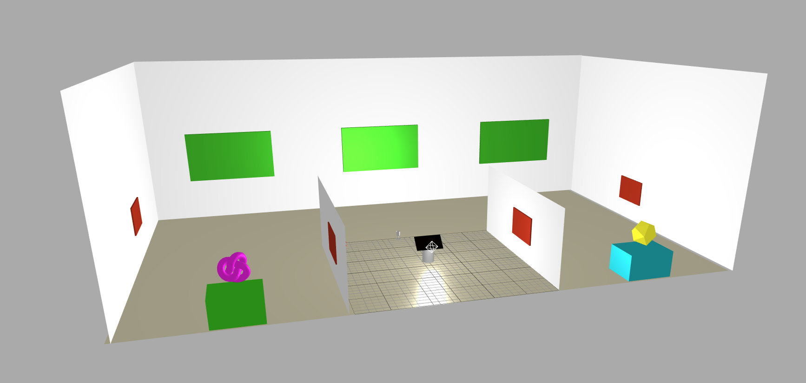

# VR Gallery #

#### By _**CJ Rhone**_ 2/19/19

- - - -

### Project Description ###

_VR Gallery_ will guide users through a bare-bones demonstration of how to develop an Web VR app using WebGL; Includes an overview of app structure and visual representations of WebGL procedural effects and capabilities 

### Project’s Purpose or Goal: ###
The purpose of this project is to make WebGL and WebVR easier to digest for beginners. This project will explore WebGL for it’s strengths by allowing users to interact with various elements and learn how it's created.  

## Overview / Diagram ##
  

## NOTE: This project will be actively improving, and may be at an unfinished state while previewing ##

#### List the absolute minimum features the project requires to meet this purpose or goal: ####
* User controlled first-person movement ( similar to FPS videogame )
* Web VR capabilities
* Interactable objects that showcase WebGL capabilities

#### What tools, frameworks, libraries, APIs, modules and/or other resources (whatever is specific to your track, and your language) will you use to create this MVP? List them all here. Be specific. ####
**HTML, CSS, Javascript**
* **WebVR**
* **Three.js**
 * Javascript 3D Library: `https://github.com/mrdoob/three.js/`
* **Ammo.js**
 * Bullet Physics Engine: `https://github.com/kripken/ammo.js/`
* **Physij.js**
 * Physics Plugin for Three.js: `http://chandlerprall.github.io/Physijs/`

#### If you finish developing the minimum viable product (MVP) with time to spare, what will you work on next? Describe these features here: Be specific. ####
* Photogemmetry models
 * React.js for faster server-side processing
* Textures, Lighting and Sound
 * User inputted examples
* Potentially social media integration and scrolling

#### What additional tools, frameworks, libraries, APIs, or other resources will these additional features require? ####
* Blender(3D)
* Adobe After Effects 
* Adobe Illustrator
* Autodesk

#### Is there anything else you’d like to mention? ####
My big stretch goal is making this lesson more interactive with the inclusion of user-inputted data. It would allow users to input their own data and visually spot where their data is going throughout the development process. I think that is important, because knowing where and how their inputted data is processed will overall help better understand developing in WebVR.

Beyond the MVP, I would also like to incorporate Textures and Lighting to some capacity. I think if implemented correctly, this capstone could be reusable as an online experience to showcase art, or experiment with WebVR capabilities in newer VR headsets. 

### License

*This software is licensed under the MIT license.*

Contact: *cjrh1films@gmail.com*

Copyright (c) 2019 **_CJ Rhone_**
